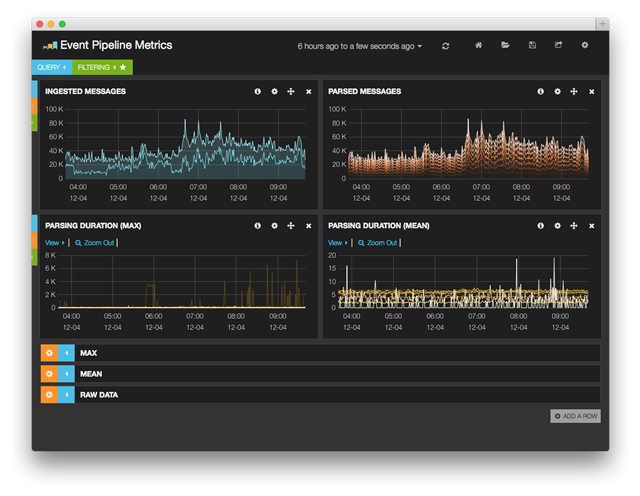

The [logsearch-pipeline][1] dashboard provides insight into how messages are processed through a logsearch deployment.
It's primarily useful when tuning and identifying bottlenecks in the deployment architecture. In order to use this,
you need to enable the [additional metadata](../guides/using-logsearch-event-metadata.md) first.

The top two charts split up messages by the job which handled them. So, here we have 2 ingestors and 7 parsers running.
The ingestors are (very) roughly balanced and the parsers are well balanced. Things to watch out for:

 * Jobs should be roughly evenly utilized. If some parser(s) are extremely underutilized compared to the rest, something
   is probably wrong with the host or network.
 * Flat-lining at a certain peak threshold indicates a bottleneck. Typically it can be solved by adding additional jobs.

The next row specifically graphs the parser performance on messages (segmented by `_type`). Left shows the maximum time
that at least one message took. The right shows the mean time and is typically more useful to identifying emergencies.
Things to watch out for:

 * Long parse times can cause backlogs. Search for events (by the `@parser[duration]` field) taking longer than 500ms,
   for example, and spend some time profiling the messages from the Raw Data row. A surge in slow-parse events can cause
   unexpected backlog and lags.

 [1]: https://github.com/logsearch/logsearch-boshrelease/blob/develop/share/kibana-dashboards/event-pipeline-metrics.json
