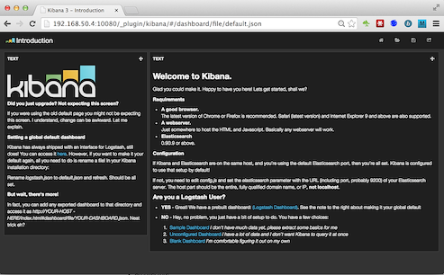

# Accessing Kibana

The test Logsearch cluster you have installed in this guide exposes Kibana via the `api/0` node.  You can access it by pointing your (modern) browser at

    http://192.168.50.4:10080/_plugin/kibana

The introductory page includes some instructions on how to create your own dashboards; but fortunately for us the Logsearch-for-weblogs Addon includes some example dashboards specifically setup to analyse weblog data.

# Uploading Logsearch-for-weblogs dashboards

Run the `upload-dashboards` script to upload some dashboards from the Logsearch-for-weblogs Addon.  eg:

    [logsearch workspace] ~/environments/local/test ▸ ./logsearch/logsearch-for-weblogs/bin/upload-dashboards 
    ===> Uploading dashboards...
    * Geo-IP - {"_index":"kibana-int","_type":"dashboard","_id":"Geo-IP","_version":11,"created":true}
    DONE!

That done, click the "open dashboard icon " at the top right of Kibana to see a lite of imported dashboards.

Click on the `Geo-IP` dashboard to show the following:

