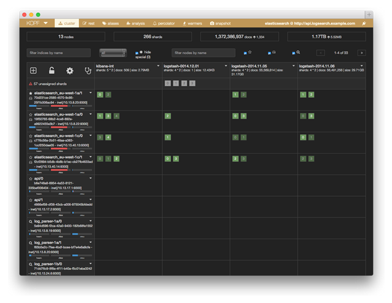

The easiest way to monitor the elasticsearch cluster health is by using a tool like [KOPF][1] which provides a high
level overview. Open the following URL, but replace the `location` parameter with your own elasticsearch hostname:

    http://lmenezes.com/elasticsearch-kopf/?location=http://api.logsearch.example.io

You should be presented with a page that looks like:

# Color State

The first thing you should look for is the colored bar at the top (representing the three colors elasticsearch uses
to relay its cluster health). In the above screenshot, the cluster is in a Yellow state.

You should never see **Red**. If it is red, something is terribly wrong and elasticsearch has not been able to load
enough copies of your data for it to be usable. Typically this means a significant number of nodes have gone offline.

When it's **Yellow**, a quorum of the data is accessible but some shards and nodes are likely missing. Typically, the
cluster has degraded performance due to consuming additional CPU and Network I/O to resurrect the missing shards and
less parallelism. It's important to note that although all the data is accessible, the cluster is still extremely
fragile and further nodes crashing could cause data loss.

If the cluster is either Red or Yellow, you should try the following...

 * [Resurrect any missing nodes](/bosh/using-bosh-cck.md)
 * [Find missing elasticsearch data](./what-data-is-elasticsearch-missing.md)

When the cluster is **Green**, elasticsearch is relatively happy since it has been able to load all the copies of data
it expects.

# Heap, Disk, and CPU Usage

The next most significant things to look at are conveniently shown as small bar charts on the left side below each node
name.

## CPU

The last chart measures how much CPU is actively being used. Generally you should always see some CPU activity happening
on all the nodes. Nodes which are consistently using 100% of CPU should be investigated - something may be wrong.

You may want to use KOPF's filtering to only look at specific elasticsearch roles. For example, elasticsearch runs on
all the log parsers in a client-only role, but practically all CPU shown there will be generated by the log parsing
processes and unlikely to directly affect elasticsearch health. You can hide those client-only nodes by unchecking the
magnifying glass just above the table.

## Disk

The middle chart measures how much of elasticsearch's disk is being used. Typically this represents the persistent disk
(and not the ephemeral or system disk). Elasticsearch does a fairly good job at keeping data balanced across all the
nodes.

If disk usage is abnormally unbalanced, something may be wrong.

 * fix1 - guide to re-enabling allocation/rebalancing

If disk usage is well-balanced and all of them are significantly full, something may go wrong soon.

 * fix1 - add more nodes
 * fix2 - use larger disks
 * fix3 - purge old data

## Heap

The first chart measures the heap usage relative to the available RAM. Frequently you'll see elasticsearch heap limited
to about half of the available RAM (which leaves the other half to focus on file system caching). When a node is
restarted, the heap may start back at zero, slowly working its way up to its limit.

If a data node is using very little heap, something is wrong.

 * fix1 - fancy heap analysis?

# Unhealthy Shards

    @todo
    mention relocating

 [1]: https://github.com/lmenezes/elasticsearch-kopf
 [2]: lmenezes.com/elasticsearch-kopf/
